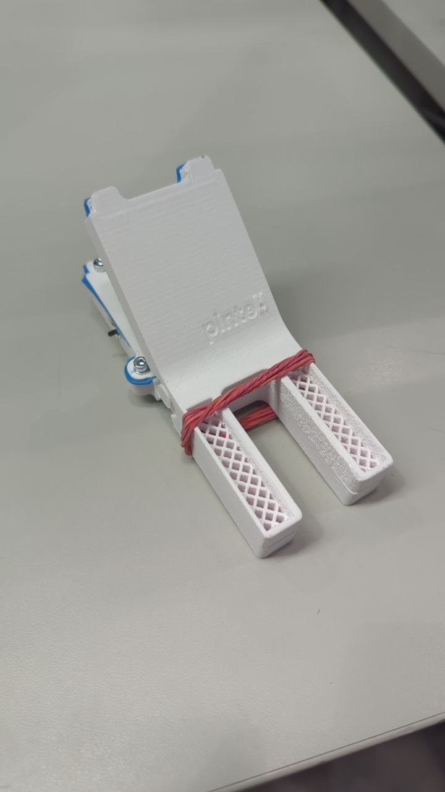

# Pintell – Smart Laundry Moisture Monitor

  

**Course:** ELEC-C9822 – Design Thinking and Advanced Prototyping (10 credits)  
**Purpose:** Pintell is designed to monitor your laundry's moisture levels in real-time, letting you know exactly when your clothes are dry. It saves time and energy compared to using dryers, relying on the weather, or checking manually.
**Note:** Unlike a traditional clothespin, Pintell’s primary focus is **accurate moisture monitoring**, not holding clothes in place. For best results, clip it to the *bottom* of the garment: moisture naturally moves downward as clothes dry, and the bottom retains moisture the longest. The **core functionality of Pintell is precise real-time moisture data**, even though the form is inspired by the familiar clothespin.

---

## System Overview
Pintell combines smart electronics, embedded programming, and cloud connectivity to deliver actionable laundry insights:

- **Electronics:** Sensors detect moisture levels accurately; PCB and power management ensure durability and efficiency.
- **Embedded Programming:** Microcontroller firmware processes sensor data and communicates with the app.
- **Cloud Services:** Real-time data storage and analysis for user notifications.
- **Mobile App:** Displays moisture readings and sends alerts when laundry is dry.

---

## Hardware Overview
**Petteri Suonpää – Electronics Engineering**  
This was my role and I Designed and developed the electronic system for Pintell. Key highlights:

- **Moisture Sensor:** High-accuracy sensor integrated at the bottom of the garment for precise readings.  
- **PCB Design:** Compact layout optimized for low power consumption and durability.  
- **Power Management:** Efficient battery system enabling extended use between charges.  
- **Connectivity:** Microcontroller handles sensor data and transmits it to the mobile app.  

### Hardware Photos
1. **PCB & Electronics Assembly**  
[📄 Pintell Design Report (PDF)](Kicad_layout.pdf)
2. **Sensor Integration Close-up**  

3. **Final Product in Use**  

---

## Team Members & Roles
- **Vu Minh, Nguyen** – Cloud Service Programming  
- **Khanh, Pham** – App Programming (Project Manager)  
- **Petteri, Suonpää – Electronics Engineering** ✅  
- **Julius, Lappalainen** – Embedded Programming  
- **Aykhan, Najafov** – User Experience and Interaction Design  
- **Duc Anh, Pham** – Physical Design  

---

## Features
- Real-time moisture monitoring  
- Notifications when laundry is dry  
- Efficient power usage for prolonged battery life  
- Easy-to-clip design inspired by a clothespin  

---

## Usage
1. Clip Pintell to the **bottom of a garment**.  
2. Turn the device on; it will automatically detect moisture levels.  
3. Connect to the mobile app to monitor progress in real-time.  
4. Receive alerts when the garment is dry and ready.  

---
